# Dev_Stack – Production-Ready Multi-Agent Development System

> **Fully integrated LLM-powered multi-agent development workflow with RAG, context management, and intelligent code generation.**

A **production-ready, containerized** development system where multiple specialized AI agents collaborate autonomously using real LLM providers (OpenAI, Anthropic, Google Gemini). Each agent works in isolation using **Docker containers** and **Git worktrees**, with full **RAG integration** for context-aware code generation.

**Topics**: `ai-agents`, `llm`, `rag`, `docker`, `git-worktree`, `autonomous-coding`, `anthropic`, `openai`, `multi-agent`

---

## 🎯 Overview

Dev_Stack enables you to orchestrate multiple specialized AI agents working together autonomously on your codebase:

- **🎯 Taskmaster** (OpenAI GPT-4o): Plans and decomposes requirements into tasks
- **👨‍💻 Dev1** (Anthropic Claude): Implements core business logic
- **👩‍💻 Dev2** (Anthropic Claude): Builds APIs and integrations  
- **🧪 Testing** (Anthropic Claude): Writes and executes tests
- **🔍 Review** (OpenAI GPT-4o): Performs code reviews and security audits
- **🚀 DevOps** (Anthropic Claude): Merges code and maintains CI/CD

### ✨ What's New in v2.0

- ✅ **Full LLM Integration** - Real AI agents, not simulations
- ✅ **RAG-Powered Context** - Agents search your codebase semantically before coding
- ✅ **Multi-Provider Support** - OpenAI, Anthropic Claude, Google Gemini
- ✅ **Intelligent Code Generation** - Context-aware with automatic validation
- ✅ **Conversation Management** - Multi-turn conversations with token tracking
- ✅ **Role-Specific Prompts** - Each agent has specialized system instructions
- ✅ **Automatic Code Formatting** - Black integration for Python files
- ✅ **Safety Features** - Syntax validation, backups, and rollback capability

---

## 🏗️ Architecture

```mermaid
graph TD
    Human[👤 Human] -->|Chat/Requirements| Taskmaster
    
    subgraph "AI Agent System"
        Taskmaster[🎯 Taskmaster<br/>GPT-4o] -->|Create/Assign Tasks| JSON[(tasks.json)]
        JSON -->|Notify| Agents
        
        subgraph Agents [Docker Containers + LLM]
            Dev1[👨‍💻 Dev1<br/>Claude]
            Dev2[👩‍💻 Dev2<br/>Claude]
            Testing[🧪 Testing<br/>Claude]
            Review[🔍 Review<br/>GPT-4o]
            DevOps[🚀 DevOps<br/>Claude]
        end
        
        subgraph Intelligence
            RAG[🧠 RAG<br/>ChromaDB]
            LLM[🤖 LLM APIs<br/>OpenAI/Anthropic]
        end
        
        Taskmaster <-->|Plan & Decompose| LLM
        Agents <-->|Query Context| RAG
        Agents <-->|Generate Code| LLM
    end
    
    Agents -->|Commit| Git[📦 Git Repository]
    Agents -->|Update Status| JSON
```



### Core Components

1. **LLM Integration** (`scripts/llm_client.py`):
   - Supports OpenAI, Anthropic, and Google Gemini
   - Automatic retry with exponential backoff
   - Token counting and budget tracking
   - Conversation history management

2. **RAG System** (`scripts/rag_client.py`):
   - Semantic code search via ChromaDB
   - Automatic context injection into prompts
   - Finds similar implementations and patterns
   - Dependency tracking

3. **Context Manager** (`scripts/context_manager.py`):
   - Multi-turn conversation history
   - Automatic token limit management
   - Conversation persistence and export

4. **Intelligent Code Editor** (`scripts/code_editor.py`):
   - Parses LLM responses for code changes
   - Syntax validation before applying
   - Automatic backups with rollback
   - Auto-formatting with Black

5. **Agent Listener** (`scripts/agent_listener.py`):
   - Monitors tasks and executes work
   - Role-specific system prompts
   - RAG-enhanced code generation
   - Automatic status transitions

---

## 🧠 LLM Configuration

### Supported Providers

Configure via `.env` file:

#### OpenAI (Taskmaster & Review)
```env
OPENAI_API_KEY=sk-your-key-here
OPENAI_MODEL=gpt-4o
```

#### Anthropic (Dev1, Dev2, Testing, DevOps)
```env
ANTHROPIC_API_KEY=sk-ant-your-key-here
ANTHROPIC_MODEL=claude-sonnet-4-20250514
```

#### Google Gemini (Optional)
```env
GOOGLE_API_KEY=your-key-here
GOOGLE_MODEL=gemini-1.5-pro
```

### Per-Agent Provider Override

Each agent can use a different LLM provider. This is configured in `docker-compose.agents.yml`:

```yaml
agent_taskmaster:
  environment:
    - LLM_PROVIDER=openai  # Uses GPT-4o

agent_dev1:
  environment:
    - LLM_PROVIDER=anthropic  # Uses Claude
```

---

## 📋 Prerequisites

- ✅ **Docker Desktop** installed and running
- ✅ **Git** installed (version 2.25+)
- ✅ **Python 3.8+** installed
- ✅ **LLM API Key** (OpenAI, Anthropic, or Google)

---

## 🚀 Quick Start

### 1. Clone and Initialize

```bash
git clone https://github.com/your/dev_stack.git my-project
cd my-project
git init
git add .
git commit -m "chore: initialize Dev_Stack"
git branch dev
```

### 2. Install Dependencies

```bash
pip install -r requirements.txt
```

This installs:
- `chromadb` - Vector database for RAG
- `openai` / `anthropic` / `google-generativeai` - LLM providers
- `tiktoken` - Token counting
- `tenacity` - Retry logic
- `black` - Code formatting
- And more...

### 3. Configure API Keys

```bash
cp .env.example .env
# Edit .env and add your API keys
```

**Required:**
- `OPENAI_API_KEY` - For Taskmaster and Review agents
- `ANTHROPIC_API_KEY` - For Dev1, Dev2, Testing, DevOps agents

### 4. Setup Worktrees

```bash
bash scripts/setup_worktrees.sh
```

### 5. Start Infrastructure

```bash
# Start ChromaDB and all agents
docker compose -f docker-compose.yml -f docker-compose.agents.yml up -d
```

### 6. Index Your Codebase (RAG)

```bash
# Index code for semantic search
python scripts/embed_codebase.py
```

This creates a vector database of you0r code that agents can query for context.

---

## 📁 Where is the Generated Code?

> **⚠️ IMPORTANT**: Agents create code in **worktrees**, not in your main repository directory!

Each agent works in an isolated Git worktree to prevent merge conflicts:

```bash
# Agent: Dev1
.worktrees/dev1/src/         # ← Dev1's generated code here
.worktrees/dev1/tests/       # ← Tests here
.worktrees/dev1/work_artifacts/  # ← LLM responses

# Agent: Dev2
.worktrees/dev2/src/         # ← Dev2's code

# Agent: Testing
.worktrees/testing/tests/    # ← Generated tests
```

### Viewing Generated Code

```bash
# View all Python files created by agents
Get-ChildItem -Path .worktrees -Recurse -Filter "*.py"

# Check Dev1's code
ls .worktrees/dev1/src/

# View a specific file
cat .worktrees/dev1/src/core/greeting.py

# See LLM responses
cat .worktrees/dev1/work_artifacts/T-002_response.md
```

### Feature Branch Integration

When tasks are **APPROVED**, the DevOps agent creates a feature branch:

```bash
# DevOps automatically creates:
feature/t-002-personalized-greeting

# You can also manually integrate:
python scripts/devops_git_integration.py T-002 .worktrees/dev1
```

**Workflow**:
1. Dev1 creates code → `.worktrees/dev1/`
2. Task moves through pipeline → TESTING → REVIEW → APPROVED
3. DevOps creates feature branch → `feature/t-xxx-description`
4. **You review and merge** the feature branch

**See**: [docs/devops_integration.md](docs/devops_integration.md) for details

---

## 💼 How It Works

### 1. Chat with Taskmaster (Interactive Mode)

The easiest way to use Dev_Stack is through the **interactive Taskmaster chat**:

```bash
# Start the watcher (monitors task changes)
python scripts/watcher.py

# In another terminal, start Taskmaster chat
python scripts/taskmaster_chat.py
```

**Then just chat naturally:**

```
You: I need user authentication with JWT tokens for login and registration

🎯 Taskmaster: I'll break this down into tasks for the team:

1. Create User model and authentication logic (Dev1)
2. Add JWT token generation and validation (Dev1)
3. Create login and registration endpoints (Dev2)
4. Add authentication tests (Testing)

📝 Creating tasks...

  ✅ Created T-003: Create User model → Dev1
  ✅ Created T-004: Add JWT utilities → Dev1
  ✅ Created T-005: Create auth endpoints → Dev2
  ✅ Created T-006: Add auth tests → Testing

✅ Created 4 task(s). The watcher will notify agents.
```

**Taskmaster Features:**
- Natural language task creation
- Intelligent task breakdown
- Automatic agent assignment
- Conversation context for follow-ups
- Status tracking with `status` command

### 2. Agents Execute Automatically

Once tasks are created, agents work autonomously:

**Dev1 agent** (running Anthropic Claude):

1. **Receives notification** from watcher
2. **Queries RAG** for similar authentication code
3. **Builds context** with relevant code snippets
4. **Generates code** using Claude with full context
5. **Validates syntax** before applying changes
6. **Creates files** with automatic backups
7. **Updates task status** to TESTING
8. **Auto-reassigns** to Testing agent

### 3. Automatic Workflow Progression

Tasks automatically flow through the pipeline:

```
TODO → WIP (Dev1/Dev2 working)
  ↓
TESTING (Auto-assigned to Testing agent)
  ↓
REVIEW (Auto-assigned to Review agent)
  ↓
APPROVED (Auto-assigned to DevOps agent)
  ↓
COMPLETED (Merged and done!)
```

**No manual reassignment needed!** The system handles the entire workflow automatically.

### Alternative: Manual Task Creation

You can also create tasks manually if preferred:

```bash
python scripts/task_manager.py add \
  --title "Add user authentication" \
  --assigned "Dev1" \
  --description "Implement JWT-based authentication"
```

---

## 📊 Features

### RAG-Powered Code Generation

Agents don't code in a vacuum. Before generating code, they:

```python
# Agent queries codebase
rag_results = rag_client.query("authentication patterns", n_results=5)

# Relevant code is injected into LLM prompt
context = """
## Relevant Code from Codebase

### Source: auth/login.py
```python
def authenticate_user(username, password):
    # Existing auth logic...
```
"""

# LLM generates code aware of existing patterns
response = llm.generate(context + task_description)
```

### Intelligent Code Editing

```python
# LLM response is parsed
### File: auth/register.py
```python
def register_user(email, password):
    # New registration logic
```

# Code is validated, backed up, and applied
editor.parse_and_apply(llm_response)
```

### Conversation History

Each task maintains full conversation context:

```
work_artifacts/contexts/
├── T-001_Dev1.json              # State
├── T-001_Dev1_conversation.md   # Human-readable
└── ...
```

### Token Tracking

```
✅ LLM Response received (1,247 tokens)
   Total tokens used: 3,891
   Estimated cost: $0.02
```

---

## 🛠️ Agent Roles

| Agent | LLM Provider | Model | Responsibility |
|-------|--------------|-------|----------------|
| **Taskmaster** | OpenAI | GPT-4o | Task decomposition, planning |
| **Dev1** | Anthropic | Claude Sonnet 4 | Core business logic |
| **Dev2** | Anthropic | Claude Sonnet 4 | APIs & integrations |
| **Testing** | Anthropic | Claude Sonnet 4 | Test generation & QA |
| **Review** | OpenAI | GPT-4o | Code review & security |
| **DevOps** | Anthropic | Claude Sonnet 4 | CI/CD & merging |

---

## 📚 Documentation

- **[QUICKSTART.md](QUICKSTART.md)** - Get started in 5 minutes
- **[docs/cursor_integration.md](docs/cursor_integration.md)** - Chat with Taskmaster via Cursor/LLM
- **[docs/llm_integration.md](docs/llm_integration.md)** - Complete LLM integration guide
- **[docs/devops_integration.md](docs/devops_integration.md)** - Feature branch workflow
- **[docs/agents.md](docs/agents.md)** - Detailed agent roles and workflows
- **[docs/architecture_decisions.md](docs/architecture_decisions.md)** - Design decisions

---

## 🔒 Security

- **API Keys**: Stored in `.env` (gitignored)
- **Non-Root Containers**: All agents run as unprivileged users
- **Code Validation**: Syntax checking before file writes
- **Backups**: Automatic backups in `.code_backups/`
- **Network Isolation**: Private Docker network

---

## 💾 Data Persistence

- **ChromaDB**: Vector data in `chroma_data` volume
- **Tasks**: `tasks.json` on host machine
- **Code**: Git worktrees with full history
- **Conversations**: Saved in `work_artifacts/contexts/`
- **Backups**: Code backups in `.code_backups/`

---

## 🐛 Troubleshooting

### Agent not responding

```bash
# Check logs
docker logs -f agent_dev1

# Verify API key
cat .env | grep API_KEY

# Restart agent
docker restart agent_dev1
```

### RAG not finding code

```bash
# Re-index codebase
python scripts/embed_codebase.py

# Check ChromaDB
docker logs chroma
```

### Token limit errors

Edit `config/agent_config.yml`:
```yaml
dev1:
  max_tokens: 4000  # Reduce if hitting limits
  rag_chunks: 5     # Reduce context size
```

---

## 📈 Cost Optimization

Typical costs per task (GPT-4o/Claude Sonnet):

- **Simple task** (add function): ~$0.01
- **Medium task** (implement feature): ~$0.05
- **Complex task** (full module): ~$0.15

**Tips to reduce costs:**
1. Use `gpt-4o-mini` instead of `gpt-4o` (10x cheaper)
2. Reduce `max_tokens` in agent config
3. Limit RAG chunks to 3-5 instead of 10+
4. Use temperature=0.3 for code tasks

---

## 🎓 Example: Full Workflow

### Option 1: Chat with Taskmaster (Recommended)

**In Cursor or your LLM interface:**

**You:**
> "Act as Taskmaster. I need to implement password reset functionality via email. Break this down into tasks and assign them to the appropriate agents."

**Taskmaster:**
> "I'll create the following tasks:
> 1. Dev1: Implement password reset token generation and validation logic
> 2. Dev2: Create password reset API endpoints and email service integration
> 3. Testing: Write tests for password reset flow
>
> Creating tasks now..."

```bash
# Taskmaster executes:
python scripts/task_manager.py add \
  --title "Password reset token logic" \
  --assigned "Dev1" \
  --description "Implement secure token generation with expiry and validation"

python scripts/task_manager.py add \
  --title "Password reset API and email" \
  --assigned "Dev2" \
  --description "Create /api/reset-password endpoint and integrate email service"
```

### Option 2: Manual Task Creation

```bash
# Create task directly
python scripts/task_manager.py add \
  --title "Add password reset" \
  --assigned "Dev1" \
  --description "Implement password reset via email"
```

### Watch Agents Work

```bash
# Watch agent work
docker logs -f agent_dev1

# Output:
# 🔍 Searching codebase for relevant context...
#    Found 5 relevant code snippets
# 🤖 Querying LLM for implementation...
# ✅ LLM Response received (2,341 tokens)
# 📝 Parsing and applying code changes...
# ✅ Successfully applied 3 file changes
#    - auth/reset_password.py
#    - auth/email_service.py
#    - tests/test_reset.py
```

### Check Results

```bash
# Code is in worktrees, not main repo!
cat .worktrees/dev1/auth/reset_password.py

# Or check the feature branch after DevOps integration
git checkout feature/t-xxx-password-reset
cat auth/reset_password.py
```

**For more chat examples, see [docs/cursor_integration.md](docs/cursor_integration.md)**

---

## 🤝 Contributing

Contributions welcome! This is a community-driven project.

---

## 📄 License

MIT License - See [LICENSE](LICENSE) file

---

**Version**: 2.0  
**Last Updated**: 2025-11-25  
**Maintained By**: Dev_Stack Community

**Ready to let AI agents build your code!** 🚀
