# Dev_Stack – Local Multi-Agent Development System

> **Local multi-agent dev workflow template (Docker, Git worktrees, RAG, Cursor-friendly).**

A **fully local, containerized** development workflow where multiple AI agents collaborate in parallel without conflicts.
Each agent works in isolation using **Docker containers** and **Git worktrees**.

**Topics**: `dev-tools`, `ai-agents`, `docker`, `git-worktree`, `rag`, `cursor`, `local-llm`

---

## 🎯 Overview

Dev_Stack enables you to orchestrate multiple specialized AI agents working together on a codebase:

- **Taskmaster**: Plans and assigns tasks
- **Dev1**: Implements core business logic
- **Dev2**: Builds APIs and integrations
- **Testing**: Writes and executes tests
- **Review**: Performs code reviews
- **DevOps**: Merges code and maintains CI/CD

## 🏗️ Architecture

```mermaid
graph TD
    Human[👤 Human] -->|Chat| Taskmaster[🤖 Taskmaster]
    Taskmaster -->|1. Create Task| JSON[(tasks.json)]
    
    subgraph Automation
        JSON -->|2. Detect Change| Watcher[👀 Watcher Service]
        Watcher -->|3. Wake Up| Agents
    end
    
    subgraph Agents [Docker Containers]
        Dev1[👨‍💻 Dev1]
        Dev2[👩‍💻 Dev2]
        Testing[🧪 Testing]
        Review[🔍 Review]
        DevOps[🚀 DevOps]
    end
    
    Watcher -.->|Assign| Dev1
    Watcher -.->|Assign| Dev2
    
    Dev1 -->|4. Commit| Git[Git Repository]
    Dev2 -->|4. Commit| Git
    
    Dev1 -->|5. Status: TESTING| JSON
    Dev2 -->|5. Status: TESTING| JSON
    
    Watcher -.->|Trigger| Testing
    Testing -->|6. Test & Verify| Git
    Testing -->|7. Status: REVIEW| JSON
    
    Watcher -.->|Trigger| Review
    Review -->|8. Approve| Git
    Review -->|9. Status: APPROVED| JSON
    
    Watcher -.->|Trigger| DevOps
    DevOps -->|10. Merge to Dev| Git
    DevOps -->|11. Status: COMPLETED| JSON
```



### Core Components

1.  **tasks.json** (Source of Truth):
    -   All tasks and their status are stored in a structured JSON format.
    -   `docs/tasks.md` is auto-generated from this file for human readability.
    -   Agents read/write JSON to avoid parsing errors.

2.  **Watcher Service** (`scripts/watcher.py`):
    -   Monitors `tasks.json` for changes.
    -   Automatically wakes up agents (via Docker Exec) when a task is assigned to them or their status changes.

3.  **RAG Memory** (ChromaDB):
    -   A vector database indexes the entire codebase.
    -   Agents can perform semantic searches to understand context without reading every file.

4.  **Safety Net** (Git Hooks):
    -   `pre-commit` hooks ensure that only valid code (linted, no syntax errors) is committed.

5.  **Agent Automation** (`scripts/agent_listener.py`):
    -   A reference implementation of an agent loop running inside each container.
    -   Listens for task assignments and simulates agent activity (can be extended with LLM logic).

---

---

## 🧠 LLM Configuration

Dev_Stack supports multiple LLM providers. You can configure which one to use via environment variables in `.env`.

### Supported Providers

Set `LLM_PROVIDER` to one of the following:

- **`openai`** (Default)
  - Requires `OPENAI_API_KEY`
  - Optional: `OPENAI_MODEL` (default: `gpt-4o`)

- **`anthropic`**
  - Requires `ANTHROPIC_API_KEY`
  - Optional: `ANTHROPIC_MODEL` (default: `claude-3-5-sonnet-20240620`)

- **`google`**
  - Requires `GOOGLE_API_KEY`
  - Optional: `GOOGLE_MODEL` (default: `gemini-1.5-pro`)

---

## 📋 Prerequisites

Before starting, ensure you have:

- ✅ **Docker Desktop** installed and running
- ✅ **Git** installed (version 2.25+)
- ✅ **Python 3.8+** installed (for host-side utility scripts)

### 1. Clone or Create Your Project

```bash
# If starting fresh
mkdir my-devstack-project
cd my-devstack-project
git init
```

### 2. Copy Dev_Stack Files

Copy all files from this repository into your project:

```
your-project/
├── docs/
│   ├── agents.md       # Agent roles and responsibilities
│   ├── tasks.md        # Task tracking (auto-generated)
│   └── decisions.md    # Architecture decisions
├── docker/
│   ├── Dockerfile.dev
│   └── entrypoint.sh
├── scripts/
│   ├── setup_worktrees.sh
│   ├── task_manager.py  # Task CLI tool
│   ├── watcher.py       # Automation service
│   ├── embed_codebase.py # RAG indexer
│   └── git_hooks/       # Quality checks
├── tasks.json          # Task database
├── docker-compose.yml
├── docker-compose.agents.yml
├── .env.example        # Environment variables template
├── .gitignore
└── README.md
```

### 3. Initialize Git Repository

```bash
# Create initial commit
git add .
git commit -m "chore: initialize Dev_Stack"

# Create dev branch
git branch dev
```

### 4. Install Host Dependencies

Install Python packages required for utility scripts:

**Linux/Mac:**
```bash
bash scripts/setup_host.sh
```

**Windows (PowerShell):**
```powershell
.\scripts\setup_host.ps1
```

This installs `pip3` (if needed) and Python packages like `chromadb` for RAG functionality.

### 5. Setup Worktrees

```bash
# On Linux/Mac/Git Bash
bash scripts/setup_worktrees.sh

# Install Git Hooks
bash scripts/install_hooks.sh
```

### 6. Start System

1. **Start Infrastructure**:
   ```bash
   # Starts ChromaDB and Agent Containers in background
   # Make sure to copy .env.example to .env first!
   cp .env.example .env
   docker compose -f docker-compose.yml -f docker-compose.agents.yml up -d
   ```

2. **Start Watcher** (in a new terminal window):
   This script acts as the "nervous system", connecting tasks to agents.
   ```bash
   python scripts/watcher.py
   ```
   _Keep this terminal open to see automation logs._

### 7. Index Code (RAG)

To give agents a "memory" of the codebase:

**Linux/Mac:**
```bash
CHROMA_HOST=localhost python3 scripts/embed_codebase.py
```

**Windows:**
```powershell
$env:CHROMA_HOST="localhost"; python scripts/embed_codebase.py
```

> **Note:** Make sure you've run `scripts/setup_host.sh` (or `.ps1` on Windows) first to install `chromadb`.


---

## 💼 Workflow

### 1. Planning (Human ↔ Taskmaster)

You generally don't edit `tasks.json` manually. Instead, use the CLI tool or chat with the **Taskmaster Agent**.

**Recommended:**
- **Chat**: "Taskmaster, create a task for login."
- **CLI**: `python scripts/task_manager.py add ...`

**Fallback:**
- Edit `tasks.json` manually (only if tools fail).

**Human**: "We need a new login page."
**Taskmaster**: Uses `scripts/task_manager.py` to create tasks:
- `T-001: Backend Login Logic` (assigned to Dev1)
- `T-002: Frontend Login Form` (assigned to Dev2)

### 2. Automation (Watcher)

The `watcher.py` script detects the new tasks in `tasks.json`.
- It **wakes up** the `agent_dev1` container.
- It **wakes up** the `agent_dev2` container.

### 3. Development (Dev Agents)

The agents receive the notification and start working.
- **Dev1**: Implements backend, commits code.
- **Dev1**: Updates status: `python scripts/task_manager.py update T-001 --status TESTING`
- **Dev2**: Implements frontend, commits code.
- **Dev2**: Updates status: `python scripts/task_manager.py update T-002 --status TESTING`

### 4. Testing

- **Watcher** detects status change to `TESTING`.
- **Testing Agent** is triggered, writes and runs tests.
- If tests pass: Updates to `REVIEW` status.
- If tests fail: Updates back to `TODO` and notifies Dev1/Dev2.

### 5. Review & Merge

- **Review Agent** is triggered when status is `REVIEW`.
- Reviews code quality, approves or requests changes.
- If approved: Updates to `APPROVED` status.
- **DevOps Agent** is triggered, merges approved code to `dev` branch.
- Updates status to `COMPLETED`.

---

## 🔒 Security

- **Non-Root Users**: All agent containers run as a non-root user (`devstack`) to prevent privilege escalation.
- **Secrets Management**: API keys and sensitive data are managed via `.env` file (not committed to Git).
- **Network Isolation**: Agents communicate over a private Docker bridge network.

## 💾 Data Persistence

- **ChromaDB**: Vector data is persisted in the `chroma_data` Docker volume. This ensures your RAG index survives container restarts.
- **Tasks**: `tasks.json` is a file on your host machine, mounted into containers. It is your primary persistent state.
- **Code**: The codebase is mounted via Git Worktrees. Changes are committed to Git, which is the ultimate source of truth for code.

## 📊 Observability

- **Dashboard**: Generate a visual status report of all tasks.
  ```bash
  python scripts/task_manager.py report --html
  ```
  Open `dashboard.html` (generated in the project root) to view the project status.

## 🏗️ Architecture Decisions

For details on scalability, conflict resolution, and trade-offs, see [docs/architecture_decisions.md](docs/architecture_decisions.md).

---


## 🛠️ Agent Roles & Branches

| Agent      | Container          | Branch         | Responsibility              |
|------------|--------------------|----------------|----------------------------|
| Taskmaster | `agent_taskmaster` | `chore/devops` | Task planning & assignment |
| Dev1       | `agent_dev1`       | `feat/dev1`    | Core business logic        |
| Dev2       | `agent_dev2`       | `feat/dev2`    | APIs & integrations        |
| Testing    | `agent_testing`    | `test/testing` | Test automation & QA       |
| Review     | `agent_review`     | `review/main`  | Code review                |
| DevOps     | `agent_devops`     | `chore/devops` | CI/CD & merging            |

---

## 🐛 Troubleshooting

### Container won't start
```bash
# Rebuild images
docker compose -f docker-compose.yml -f docker-compose.agents.yml build --no-cache
```

### Watcher not triggering
- Ensure `tasks.json` is valid JSON.
- Check if Docker is running.
- Check watcher logs in `logs/watcher.err`.

### Worktrees are broken
If you see errors about "worktree already exists" or "is not a git repository":
```bash
# Prune stale worktree entries
git worktree prune

# Re-run setup script
bash scripts/setup_worktrees.sh
```

---

**Version**: 1.1  
**Last Updated**: 2025-11-19  
**Maintained By**: Dev_Stack Community
